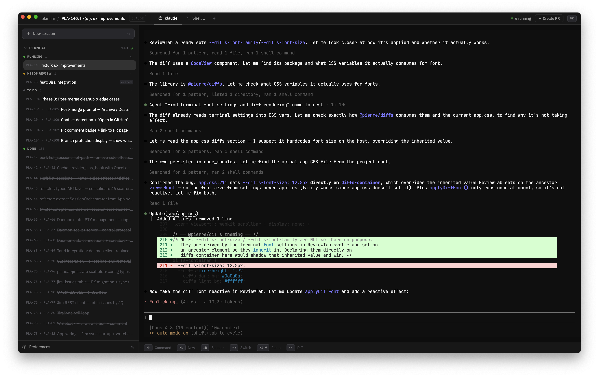
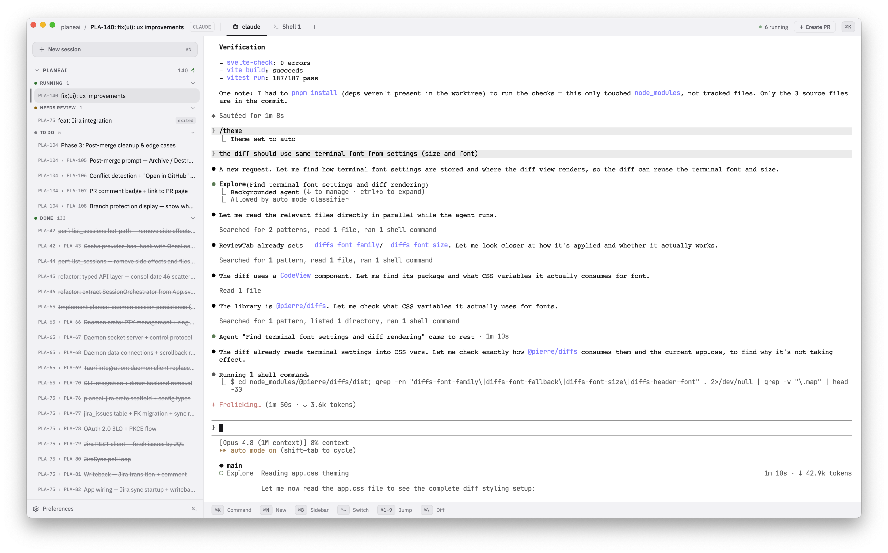
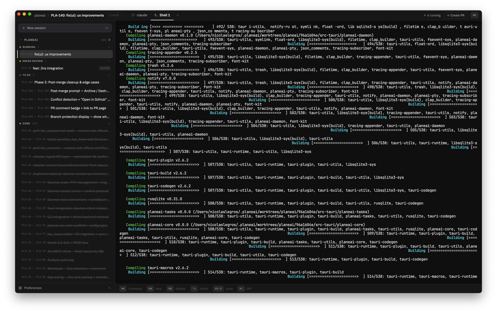
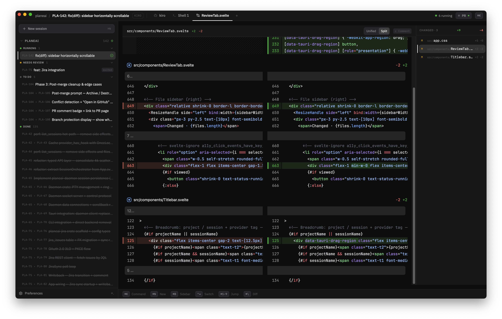

# planeai

[Documentation](https://nicolegros.github.io/planeai) · [Releases](https://github.com/nicolegros/planeai/releases/latest)

A desktop app that lets you run multiple AI coding agents in parallel — each in its own persistent terminal session, orchestrated from a keyboard-first UI. Works with Kiro, Claude, Copilot, or any CLI-based agent.

> **Status:** Early development. Expect breaking changes between releases.

<!-- TODO: Add screenshot/GIF showing the main UI with multiple sessions running -->
<table>
  <tr>
    <td align="center"><br/><sub>Bring your agent (claude, copilot, kiro, etc.)</sub></td>
    <td align="center"><br/><sub>Custom themes and presets</sub></td>
  </tr>
  <tr>
    <td align="center"><br/><sub>Multi-tab terminal w/ WebGL rendering</sub></td>
    <td align="center"><br/><sub>Review diff and send feedback to your agent</sub></td>
  </tr>
</table>

## Features

- **Parallel agents** — run as many AI coding sessions as you need, side by side
- **Persistent sessions** — agents keep running when you quit the app (tmux backend or experimental daemon backend)
- **Provider-agnostic** — works with Kiro, Claude, Copilot, or any CLI agent
- **Keyboard-first** — command menu (Cmd+K / Ctrl+K), shortcuts for every action
- **Task management** — built-in task tracker with lifecycle hooks and auto-dispatch
- **Loop recipes** — declarative YAML workflows for multi-agent loops (maker-verifier, plan-implement-review, custom)
- **Loop Runs UI** — sidebar panel + dashboard for monitoring loop progress, verifier results, and controlling loops without the terminal
- **Jira integration** — sync issues from Jira Cloud, assign to agents, and write back status changes
- **Git worktree isolation** — parallel agents work on separate branches without conflicts
- **Cross-platform** — macOS, Linux, and Windows

## Install

Download the latest release for your platform:

| Platform              | Format                                                                                                                                 |
| --------------------- | -------------------------------------------------------------------------------------------------------------------------------------- |
| macOS (Apple Silicon) | [`.dmg`](https://github.com/nicolegros/planeai/releases/latest)                                                                        |
| Linux                 | [`.deb`](https://github.com/nicolegros/planeai/releases/latest) / [`.AppImage`](https://github.com/nicolegros/planeai/releases/latest) |
| Windows               | [`.exe`](https://github.com/nicolegros/planeai/releases/latest)                                                                        |

### Requirements

- At least one AI agent CLI on PATH (e.g., `kiro-cli`, `claude`, `gh copilot`)
- tmux (optional, for persistent sessions via tmux backend — `brew install tmux` on macOS)

## Configuration

planeai is configured via `~/.config/planeai/config.json`. See the full [configuration docs](./docs/configuration.md) for providers, templates, lifecycle hooks, and auto-dispatch.

Themes are plain CSS files in `~/.config/planeai/themes/`. See the [theming guide](./docs/theming.md) for creating custom themes.

## Development

```bash
pnpm install
pnpm tauri dev
```

See [CONTRIBUTING.md](./CONTRIBUTING.md) for prerequisites, testing, and contribution guidelines.

## Tech Stack

- **Tauri v2** — Rust backend, webview shell
- **Svelte 5** — reactive UI with runes
- **xterm.js** — terminal rendering
- **Tailwind CSS** — utility-first styling
- **SQLite** — local persistence

## License

[AGPL-3.0](./LICENSE)
